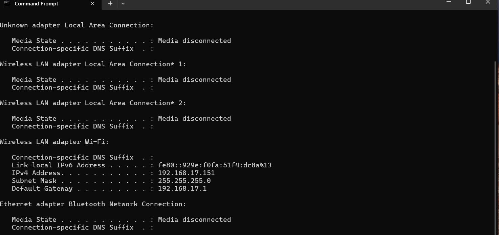
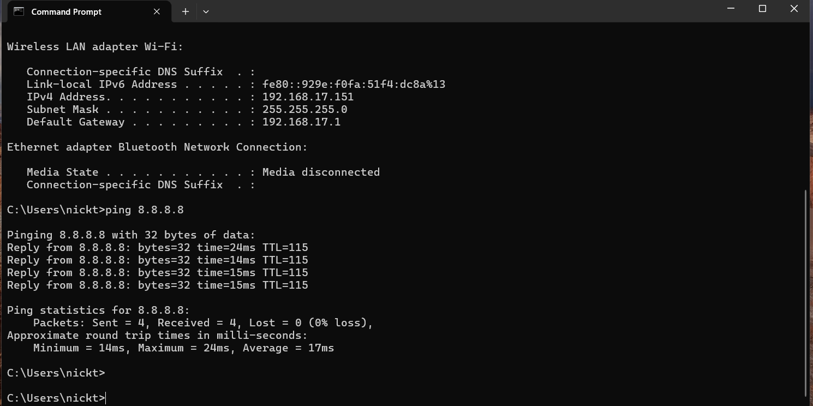
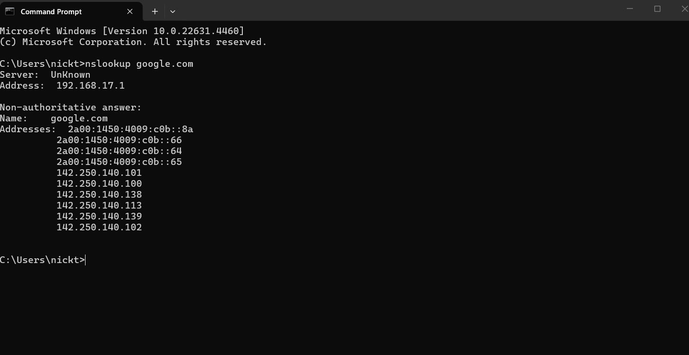

# IT Support Ticket Lab

This project simulates common service desk tickets and documents the troubleshooting steps used to diagnose and resolve them.

## Skills Practiced
- Network troubleshooting
- DNS testing
- Windows system diagnostics
- Active Directory account support
- Step-by-step troubleshooting documentation

---

## Ticket 001 - No Internet / DNS Resolution Issue

### Issue
A user reports they cannot access websites on their computer.

### Troubleshooting Steps
1. Checked IP configuration using `ipconfig`
2. Tested connectivity to a public IP using `ping 8.8.8.8`
3. Tested DNS resolution using `nslookup google.com`
4. Reviewed results to determine whether the issue was connectivity or DNS related

### Resolution
Verified that the system had a valid IP configuration, successful internet connectivity, and functioning DNS resolution. No network configuration issues were detected.

### Tools Used
- Command Prompt
- ipconfig
- ping
- nslookup

---

### Screenshots

**IP Configuration Check**

**Connectivity Test**

**DNS Resolution Test**

## Ticket 002 - Account Locked / Password Reset

### Issue
A user is unable to sign in to their account.

### Troubleshooting Steps
1. Opened Active Directory Users and Computers
2. Located the user account
3. Verified the account status
4. Unlocked the account
5. Reset the password
6. Verified the account was ready for login

### Resolution
Unlocked the user account and reset the password so the user could regain access.

### Tools Used
- Active Directory Users and Computers

---

## Ticket 003 - Slow Computer / System Health Check

### Issue
A user reports their computer is running very slowly.

### Troubleshooting Steps
1. Opened Task Manager to review CPU, memory, and disk usage
2. Identified any high-resource applications
3. Closed unnecessary processes
4. Ran `sfc /scannow` to check system file integrity
5. Reviewed overall system performance after troubleshooting

### Resolution
Used Task Manager and Windows system tools to identify resource usage and check for corrupted system files.

### Tools Used
- Task Manager
- Command Prompt
- sfc /scannow

---

## What I Learned
This lab helped me practice the same kind of troubleshooting flow used in entry-level IT and service desk roles:
- identify the issue
- check the basics first
- test one layer at a time
- document findings clearly
- resolve or escalate if needed
